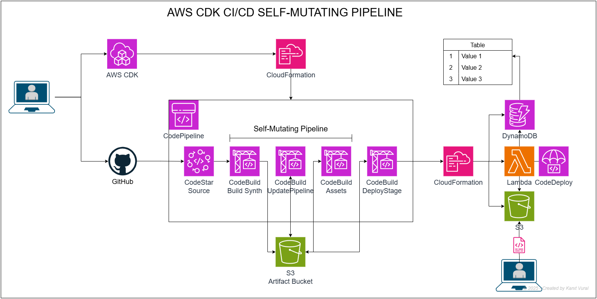
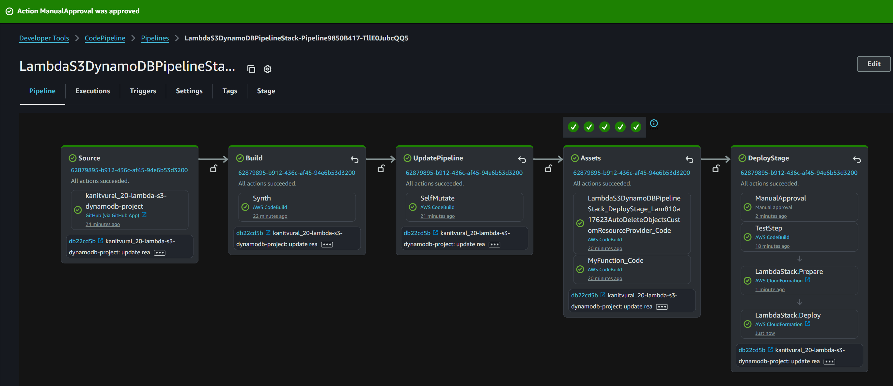
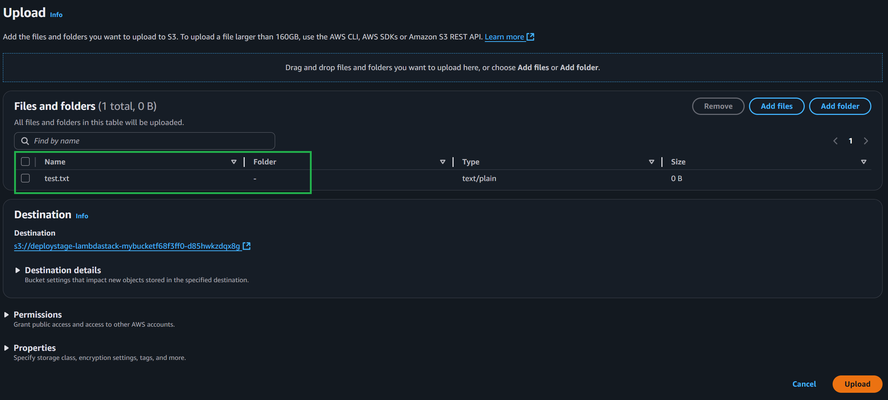
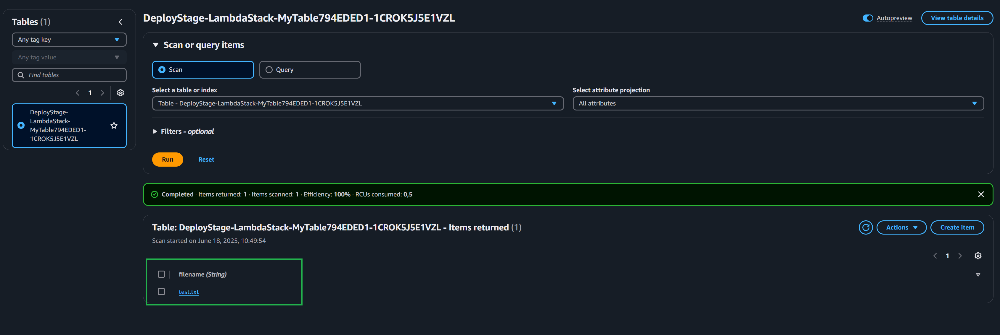
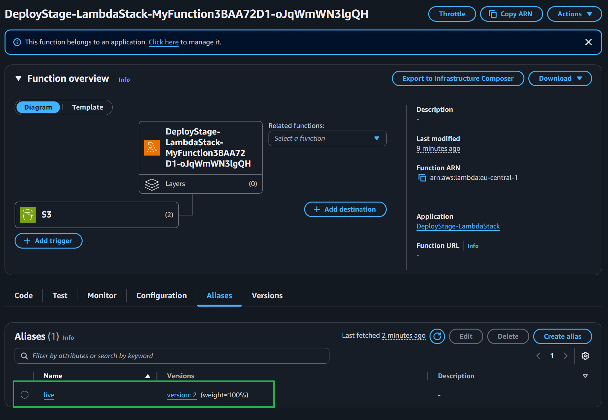
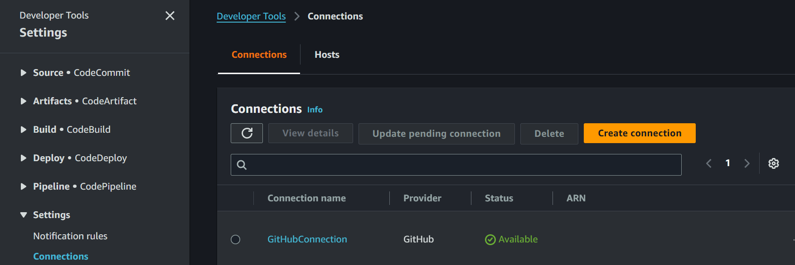

## Lambda‑S3‑DynamoDB — Self‑Mutating CDK Pipeline

### Project Description

This simple project was created to demonstrate **self-mutating deployments** using the AWS CDK.

A self-mutating CDK pipeline updates itself automatically whenever the CDK code changes — you don’t need to run cdk deploy again after changes.

1. First, the pipeline stack (`CICDPipelineStack`) is deployed **locally via CDK**. This creates a full CI/CD pipeline using **AWS CodePipeline** and **CodeBuild**.
2. Then, source code is pushed to **GitHub**, which triggers the pipeline automatically.
3. The second stack (`LambdaS3DynamoDBStack`) is deployed **through the pipeline**.  
   It provisions an **S3 bucket**, a **Lambda function**, and a **DynamoDB table**.
4. When a file is uploaded to the S3 bucket, the Lambda function is triggered and writes the file name into the DynamoDB table.

This is a minimal end-to-end example of a serverless application continuously deployed via a **self-updating CDK pipeline**.

> **Note:**  
> This type of application could also be built using **AWS SAM**, but this project intentionally uses **AWS CDK** to showcase how CI/CD pipelines can automatically update themselves (*self-mutating*) when your infrastructure code changes.


A fully‑automated CI/CD reference project that demonstrates how to:

1. **Trigger a Lambda function** whenever a file is uploaded to an S3 bucket.
2. **Write the uploaded file name** into a DynamoDB table.
3. **Deploy everything** (S3 + Lambda + DynamoDB) via an **AWS CDK pipeline** that continuously tests, synthesises, and deploys on every GitHub push.
4. **Gradually roll out Lambda update's** using **AWS CodeDeploy Canary deployments** 

### Project Structure (TL;DR)

```
├── images                       # Screenshots
├── lambda_func/handler.py       # Lambda business logic
├── tests/test_lambda_handler.py # PyTest unit tests
├── lambda_s3_dynamodb_stack/
│   ├── lambda_stack.py          # S3 + Lambda + DynamoDB
│   ├── lambda_stage.py          # Wraps the stack into a Stage
│   └── pipeline_stack.py        # CodePipeline definition
├── app.py                       # CDK App entry point
├── requirements.txt             # Required python packages
├── cdk.json                     # CDK Configuration
├── .gitignore                   # Ignores unwanted project files.
├── LICENSE.md                   # MIT License
└── README.md                    # You are here
```

### Architecture

<p align="center">
  
</p>

* **🔐 CodeStar Connection** 
  - Secure GitHub connection without storing a personal access token.
* **✅ Self‑Mutating Pipeline** 
  - The pipeline is defined *inside* the CDK app, therefore any change to the code (new stacks, stages, etc.) automatically updates the pipeline itself.
* **🌀 Canary Deployments with CodeDeploy** 
  - Lambda deployments use a canary strategy: 10% of traffic for 5 minutes before full rollout. Rollbacks happen automatically on failure.

### Screenshots

<p align="center">
  
</p>

<p align="center">
  
</p>

<p align="center">
  
</p>
<p align="center">
  
</p>


### Prerequisites

| Requirement     | Notes                                                                                          |
|----------------|------------------------------------------------------------------------------------------------|
| AWS Account     | Tested in `eu‑central‑1`                                                                       |
| AWS CLI & CDK v2 | [Install AWS CLI](https://docs.aws.amazon.com/cli/latest/userguide/install-cliv2.html), [Install AWS CDK](https://docs.aws.amazon.com/cdk/v2/guide/work-with-cdk-python.html) |
| Python 3.11      | Project code & tests                                                                          |
| GitHub Repo     | Example: `kanitvural/20-lambda-s3-dynamodb-project`                                            |
### AWS CLI Configuration (One-Time)

After creating a new IAM user with **Programmatic Access** and attaching a policy like `AdministratorAccess` or a least-privilege equivalent:

```bash
# 1. Configure AWS CLI with your credentials
$ aws configure

# You'll be prompted to enter:
# AWS Access Key ID [None]: <YOUR_ACCESS_KEY_ID>
# AWS Secret Access Key [None]: <YOUR_SECRET_ACCESS_KEY>
# Default region name [None]: eu-central-1
# Default output format [None]: json
```

### One‑Time Setup

```bash
# 1. Clone the repo
$ git clone https://github.com/kanitvural/20-lambda-s3-dynamodb-project.git
$ cd 20-lambda-s3-dynamodb-project

# 2. Initialize AWS CDK
$ cdk init app --language python

# 3. Create virtual environment (if not created by CDK)
$ python -m venv .venv

# 4. Install dependencies
# For Linux/macOS
$ source .venv/bin/activate

# For Windows (cmd)
$ .venv\Scripts\activate.bat

# For Windows (PowerShell)
$ .venv\Scripts\Activate.ps1

$ pip install -r requirements.txt

# 5. Bootstrap the target account / region (only once)
$ cdk bootstrap aws://<ACCOUNT_ID>/eu-central-1

# 6. Deploy the pipeline stack (only once)
$ cdk deploy LambdaS3DynamoDBPipelineStack
```

> **Important:**  
> After the first deploy, open the *AWS Console → CodePipeline → Settings → Connections* page and click **"Authorize"** to approve the GitHub connection.
>
> <p align="center">
  
</p>

> **CDK Setup Note:**  
> Your GitHub [CodeStar connection ARN](https://docs.aws.amazon.com/dtconsole/latest/userguide/connections-create-github.html) must be stored in the `cdk.json` file under the `context` key.  
> Example (`cdk.json`):
> ```json
> {
>   "context": {
>     "githubConnectionArn": "arn:aws:codeconnections:eu-central-1:<your-account-id>:connection/<your-connection-id>"
>   }
> }
> ```

### Development Workflow

1. **Edit code** → Implement new feature, fix a bug, or add a new stack.
2. **Commit & push** → `git push origin main`.
3. **Pipeline runs automatically**:
   * Installs dependencies.
   * Executes unit tests (`pytest`).
   * Runs `cdk synth`.
   * Deploys updated CloudFormation stacks.
4. **Observe deployments** in the CodePipeline UI or CloudFormation console.

### Local Unit Tests

Run *pytest* locally before pushing:

```bash
$ pytest tests/
```

### Clean‑up

```bash
# Destroy all CDK stacks created by the pipeline
$ cdk destroy LambdaS3DynamoDBPipelineStack
$ cdk destroy DeployStage-LambdaStack - or delete it manually from the CloudFormation console

# If you need to remove the bootstrapped resources as well
$ cdk bootstrap aws://<ACCOUNT_ID>/eu-central-1 --termination
```
